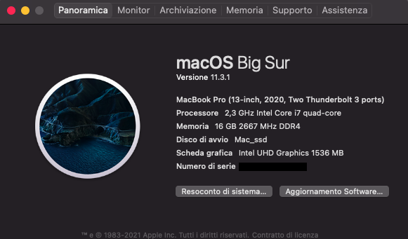
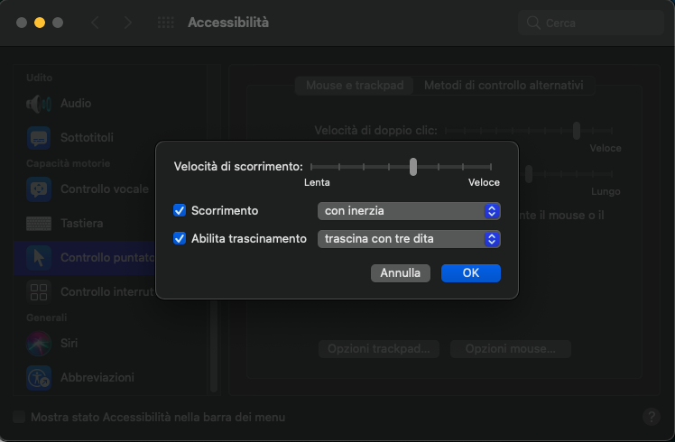
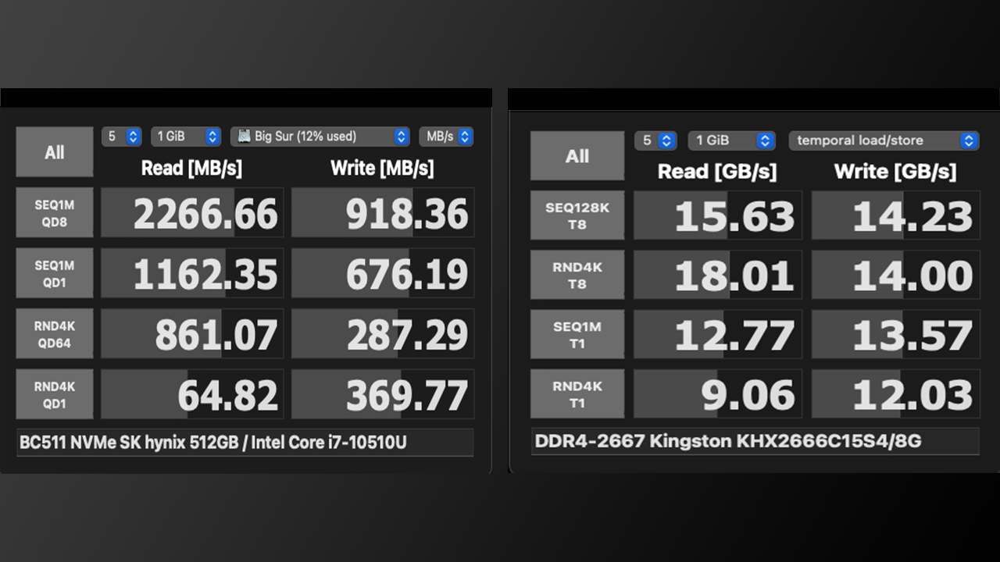

# DELL Inspiron 5491 2in1 (Comet Lake) Hackintosh

EFI for Dell Inspiron 5491 with OpenCore bootloader

(Compatible for Dell Inspiron 5491/5591, these laptops use the same bios file)

### Computer Spec:

| Component        | Brank                              |
| ---------------- | ---------------------------------- |
| CPU              | Intel i7 10510U (4C-8T 8MB CML)    |
| iGPU             | Intel® Graphics Graphics UHD       |
| Audio            | Realtek ALC236                     |
| Ram              | 16 GB DDR4 2666 Mhz                |
| Wifi + Bluetooth | BCM94360NG Fenvi                   |
| NVMe             | HYNIX BC511 512 GB (MACOS)         |
| SSD Sata         | SPCC Silicon Power 1TB (WINDOWS)   |
| SmBios           | MacBookPro 16,3                    |
| BootLoader       | OpenCore 0.6.5                     |
| macOS            | Big Sur 11.1                       |

### What works and What doesn't or WIP:

- [x] Intel Graphics UHD iGPU 
- [x] Intel Graphics UHD iGPU HDMI Output
- [x] IIntel Graphics UHD iGPU Type-C to HDMI Output
- [x] ALC236 Internal Speakers
- [ ] ALC236 Internal microphone (Digital Mic Intel SST not compatible)
- [x] USB MINI Dongle Microphones  *
- [x] ALC236 Combojack headphones
- [ ] ALC236 Combojack microphone (WIP)
- [x] ALC236 HDMI Audio Output
- [x] ALC236 TYPE-C to HDMI Audio Output
- [x] All USB-A 3.1 Ports (TYPE-C 3.2 Included)
- [x] SpeedStep / Sleep / Wake **
- [x] HID Key PWRB & SLPB 
- [x] I2C Touch pad with gesture
- [x] I2C Touch Screen
- [x] Keyboard (PS2-Internal) with backlight
- [x] F6 & F7 Brightness Key
- [x] F10 Print Screen Key
- [x] F1 & F2 & F3 Sound Key
- [x] Wi-Fi and Bluetooth BCM94360NG Module
- [x] Controller SATA III
- [x] Controller NVME PciE Gen3x4 
- [x] Micro SD Cardreader (USB-Internal)
- [x] WebCam (USB-Internal)
- [x] All Sensors CPU, IGPU, BATTERY, NVME, SATA, FAN
- [x] ACPI Battery
- [x] Apple VTD
- [x] NVRAM (Native)
- [x] Recovery (macOS) boot from OpenCore
- [x] Windows 10 boot from OpenCore

## OpenCore 0.6.5 Custum Gui by HachintoshLife

## Trik Mic Fix
* USB Dongle Mic:
At the moment there is no fix for the internal microphone and combojack microphone, as both are managed by the SST (Smart Sound Technology Intel) drive.
I use a USB dongle and it works perfectly.

       

## All Apple native shortcuts for sleep, log out and Shut Down

## CPU Performance by CPU Friend settings

See [CPUFriend](https://github.com/acidanthera/CPUFriend) For more info 

## Peripherals & TouchPad Setting & Benchmarks

### Special Config:/Users/mario/Desktop/image

- Usb port mapping performed
- SSDT-Hack Essential patch
- Applied cosmetics PCI Dev

See [ioreg](https://github.com/Speeedo83/Dell-Inspiron-5491-2in1-Hakintosh/raw/main/ioregMacBookPro.zip) for more clarification

### MacOS bootable USB creation:
- Read the Dortania guide for creating your USB from Windows or macOS
- [Guide Dortania](https://dortania.github.io/OpenCore-Install-Guide/installer-guide/) - USB creation

## Bios settings
### Enable :
* SATA Operation : AHCI
* Fastboot : Thorough
* Integrated NIC : Enable

### Disable : 
* Secure Boot
* Absolute
* TPM2.0 Security On
* Intel SGX
* SMM Security Migration
* Wake on AC
* Wake on Dell USB-C Dock
* Power On Lid Open
* Enable UEFI Network Stack
* Sign Of Life : Early Logo Display / Early keyboard backlight
* cfg lock and DVMT: DO AT YOUR OWN RISK!!! It may brick your laptop.

 

## Color profile icc with SpiderX Datacolor Pro (Standard ambient light) Screen brightness 80% 
See [calibrazione](/Dell Inspire5491.icc)
 

## Credits

- [Apple](https://apple.com) for macOS.
- [Acidanthera](https://github.com/acidanthera) for OpenCore and all the lovely hackintosh work.
- [Dortania](https://dortania.github.io/OpenCore-Install-Guide/config-laptop.plist/icelake.html) For great and detailed guides.
- [Hackintoshlifeit](https://github.com/Hackintoshlifeit) Support group for installation and post installation.

# If you need help please contact us on [Telegram](https://t.me/HackintoshLife_it) or [Web](https://www.hackintoshlife.it/)
